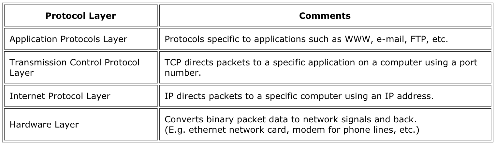
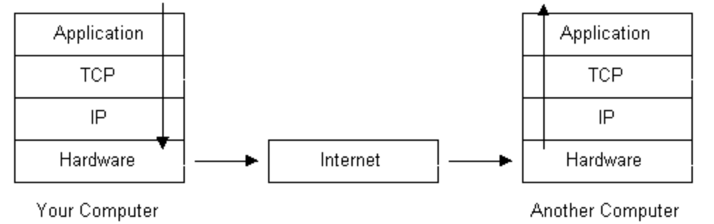

## 네트워킹 개론 

웹 서버에 대해 배우기 전에, 네트워킹(networking)이 어떻게 동작하는 지에 대해 알아보자. 
일부 용어는 친숙할 수 있으며, 그 정의를 약각 확장해서 설명할 것이다.

### 네트워킹 프로토콜 ( Networking Protocols )

_배경 정보이다. 웹 서버에 직접 이용되지는 않는다._

_프로토콜(protocol)_은 어떻게 의사소통 할 지에 대한 두 프로그램들 간에 합의이다.
인터넷을 위해,  대부분 프로토콜들은 "니가 _x_ 를 나에게 보내면, 나는 너에게 _y_ 를 보낼께."의 형태를 가진다. 인터넷에 관련된 프로토콜들은  _RFC_ 라 알려진 명세서에 알기 쉽게(?) 기술되어 있다.

니가 네트워크에 어떤 데이터를 보낼 때, 그 데이터는 데이터 무결성, 라우팅 등등의 추가 정보의 몇 개의 층이 덮어진다.

가장 높은 레벨(applicaion)에서 너는 전송할 데이터를 가지고 있다. 네트워크에서 전송할 준비가 되어 있기 때문에 데이터는 목적지에 도착하는 데 도움이 되도록 다른 데이터에 _캡슐화(encapsulated)_ 하게 된다. 
특정 데이터는 랩핑되고, 부분적으로 랩핑되지 않고, 인터넷을 통해 유선에서 유선으로 이동하면서 재 포장된다.

데이터에 랩핑되는 행위는 데이터에 새로운 _헤더(header)_ 를 넣는다. 이 헤더는 원래 데이터를 캡슐화하고 _모든 헤더들은 그 이전의 데이터에서 추가된 것이다._




각 헤더 유형에 존재하는 데이터의 세부 사항은 대부분의 사람들이 알아야하는 범위를 벗어난다. 각각이 무엇인지에 대해 짧은 설명으로 충분하다.
The details of what data exists in each header type is beyond the scope of what most people need to know. It is enough to know the short description of what each does.




데이터가 LAN을 나가서 외부 망으로 나가면, 근거리 통신망을 통한 라우팅을 담당하는 이더넷 헤더가 제거되고 IP 헤더가 조사되어 데이터가 어떻게 라우팅 되는지 확인한다. 잠재적으로 다른 프로토콜을 위한 또 다른 헤더가 DSL, 케이블 모뎀 또는 광섬유로 트래픽을 전송하도록 배치한다.

이더넷 헤더는 OS 내에 네트워크 드라이버에 의해 생성되고 관리된다.

### 소켓 (Sockets)

_배경 정보이다. 웹 서버에 직접 이용되지는 않는다. 소켓 부분은 구현되어 있다._

Unix와 같은 운영체제(OS)에서, _소켓 API (sockets API)_ 는 인터넷 트레픽을 보내기 위해 이용되는 API이다. 소켓 API는 TCP, UDP 프로토콜을 둘 다 지원하며, IPv4와 IPv6도 지원한다.

소켓 API는 앞선 그림의 TCP/IP 계층의 엑세스를 제공한다.

_소켓 디스크립퍼(socket descriptor)는 열려있는 연결을 추적하기 위해 OS가 이용하는 번호이다. 소켓 디스크립퍼는 데이터 송수신에 이용된다. 우리 웹 서버에선 `fd`란 변수로 불린다.

너는 새 소켓을 `socket()` 시스템 콜로 생성할 수 있다.


일단 생성된 후에는 특정 IP 주소 (OS가 특정 네트워크 카드와 연관시키는)에 대해 계속 _바인드(bind)_ 해야합니다. 이것은 `bind ()` 시스템 콜로 행해진다.

바인드 된 후에 `recv()`와 `send()` 시스템 콜을 이용해 소켓에 데이터를 읽고 쓸 수 있다. 

* 참고 - [Beej's Guide to Network Programming](https://beej.us/guide/bgnet/)

## HTTP

_웹 서버에서 너는 HTTP 요청을 보관하는 문자열을 구문 분석하고 HTTP 응답 문자열을 포함하는 코드 작성해야 한다. HTTP 요청과 응답이 무엇인지 살펴보자._

웹 트레픽에 필요한 마지막 정보는  _HTTP (HyperText Transport Protocol) _ 이다. TCP가 데이터 무결성을 다루고 IP가 라우팅을 다룬다면, HTTP는 웹 데이터의 `GET` 및 `POST`요청과 관련이 있다.

네트워킹의 다른 단계처럼, HTTP는 이전 데이터에 헤더를 더한다.
IP와 TCP와 마찬가지로, 이 헤더는 정확히 무엇을 보내야하는지 잘 정의 된 스펙을 가지고 있다.

사양이 복잡하지만 다행히도 barebones 버전을 구현하는 데 필요한 정보는 아주 적다.

클라이언트로부터 각 _HTTP 요청(request)_ 은 서버는 _HTTP 응답(response)_ 로 다시 보낸다.

HTTP 1.1 버전 프로토콜을 이용하는 요청과 응답하는 예제이다. `http://lambdaschool.com/example`:

HTTP 요청 셈플:

```
GET /example HTTP/1.1
Host: lambdaschool.com

```
HTTP 응답 셈플:

```
HTTP/1.1 200 OK
Date: Wed Dec 20 13:05:11 PST 2017
Connection: close
Content-Length: 41749
Content-Type: text/html

<!DOCTYPE html><html><head><title>Lambda School ...
```

요청과 응답 둘 다 헤더 끝에는 빈 줄로 구분된다.

파일이 없다면, `404` 응답이 생성되고 서버에 의해 반환된다.

```
HTTP/1.1 404 NOT FOUND
Date: Wed Dec 20 13:05:11 PST 2017
Connection: close
Content-Length: 13
Content-Type: text/plain

404 Not Found
```

웹 브라우저 디버거의 네트워크 패널을 보게 되면, 이런 헤더는 친숙할 지도 모른다.

요점 노트:

* HTTP/1.1의 경우, 요청(request)는 **반드시** `Host` 헤더를 포함 해야 한다.
* 응답(response)의 첫번째 줄의 두번째 문구는 성공 혹은 실패 표시를 제공한다.
* `Content-Length`는 요청 및 응답 본문(body)의 길이를 제공하고 헤더와 본문 사이에 빈 칸(blank line)은 세지 않는다.
* `Content-Type`은 본문에 있는 내용의 MIME 유형을 제공한다. 이것은 웹 브라우저가 페이지를 일반 텍스트, HTML, GIF 이미지 또는 다른 것으로 표시하는 방법이다. 자신만의 MIME 형식을 가지고 있다.
* 요청에 본문이 없을 지라도, 빈 칸은 **반드시** 헤더 후에 있어야 한다.
* `Connection: close`는 TCP 연결이 이번 응답 후에 종료되는 웹 브라우저를 표현한다. 이것도 포함되어야 한다.
* `Date`는 올바른 현재 날짜이어야 한다. 하지만, 이 필드는 옵션이다.